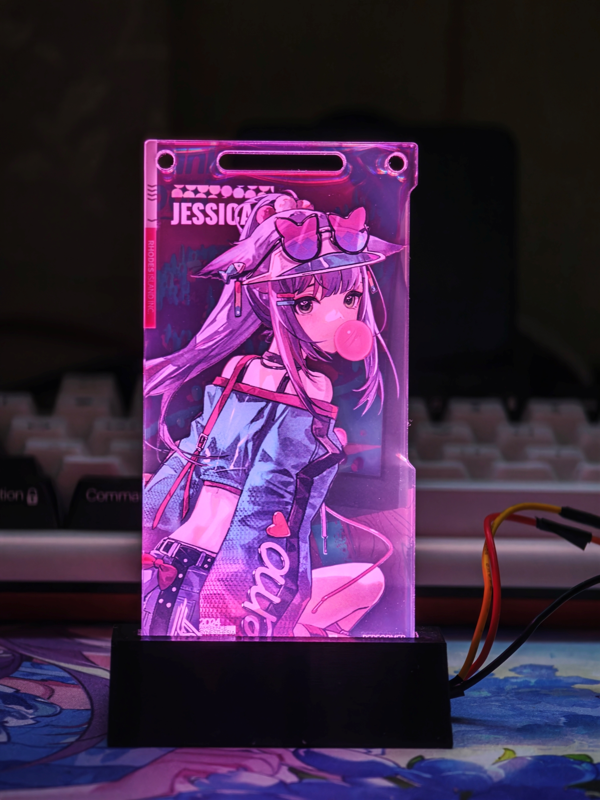

# ArkChroma

> 明日方舟通行证底座

## BOM

- ESP32S3
  - 低内存可能会遇到 `WiFi Out of Memory`
- WS2812

## 运行

### ESP32

1. 复制 `src/esp32/config.example.json` 为 `src/esp32/config.json`，按实际环境修改
   （WiFi 模式/SSID/密码、HTTP 端口、灯带 `gpio` 与 `count`、默认颜色）
2. 在设备上安装 MicroPython 依赖：
  - [aioble](https://github.com/micropython/micropython-lib/tree/master/micropython/bluetooth/aioble)
  - [microdot](https://github.com/miguelgrinberg/microdot)
  - 可通过 `mpremote mip install aioble microdot`，或手动拷贝源码到设备
3. 将 `src/esp32/main.py` 与 `config.json` 一并上传到设备

### 上位机

将仓库根目录 `config.json` 中的 `connection.host`/`port` 修改为 ESP32 实际地址：

```json
{
    "connection": { "host": "<ESP32 IP>", "port": 80 },
    "light": { "fps": 30 }
}
```

然后在仓库根目录运行（需 [uv](https://docs.astral.sh/uv/)）

```bash
uv run python -m src.host.main
```

运行后按提示选择灯效即可：

- **音乐律动**：颜色跟随当前播放音乐的专辑封面，亮度跟随音量（目前仅支持Windows）
- **Forza Horizon 转速表**：颜色随转速由绿转红（需在游戏内 设置 ->
  HUD 与游戏性 中将数据输出 IP/端口指向本机，默认端口 20777）

## 效果图


